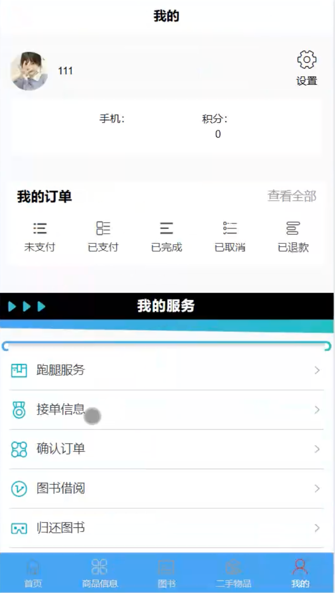
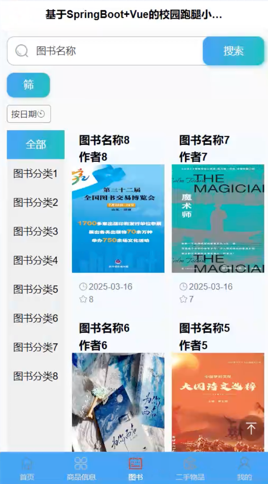
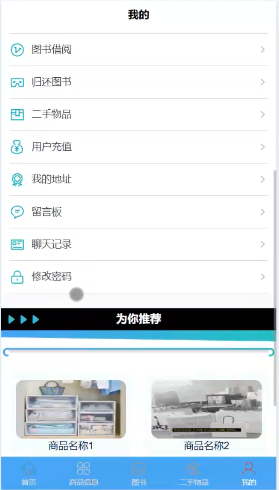
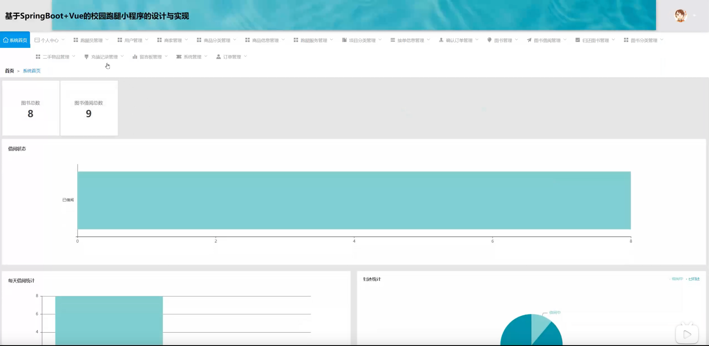
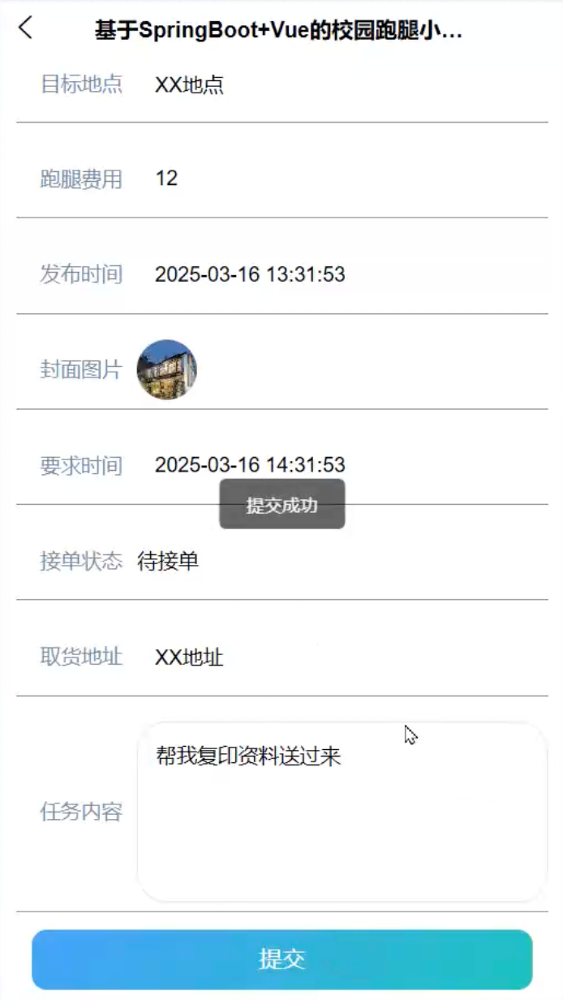
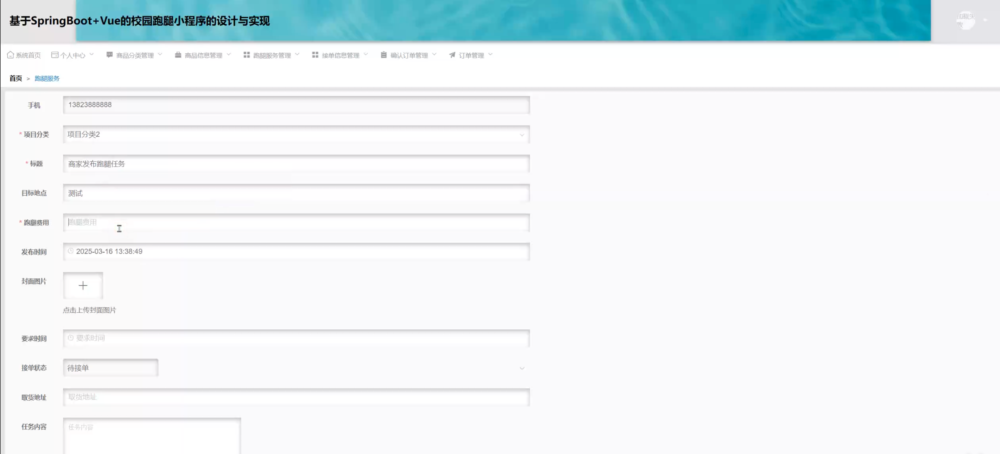

# mpweixinA231D
mpweixinA231D校园跑腿微信小程序+LW
 
## 源码问题查看主页咨询

### 一、关键词
跑腿系统、校园跑腿系统、代取系统、帮跑系统、校园代办系统

### 二、作品包含
源码+数据库+万字设计文档+全套环境和工具资源+本地部署教程

### 三、项目技术
前端技术： Html、Css、Js、Vue2.6、Element-ui、uniapp

后端技术：Java、SpringBoot2.2.2、MyBatis-Plus

### 四、运行环境（以下版本亲测，其他版本兼容性请自行测试）
开发工具：IDEA/eclipse + VSCODE + HBuilder X + 微信开发者工具

数据库：MySQL 5.7+

数据库管理工具：Navicat10以上版本

环境配置软件： JDK1.8 + Maven3.6+

前端Nodejs：14+

浏览器：谷歌浏览器

### 五、项目介绍
项目编号：mpweixinA231D

基于SpringBoot+Vue的校园跑腿微信小程序，方便学生发布和接取校园跑腿任务，提升校园生活便利性。

角色：管理员、用户、商家、跑腿员

用户功能：注册登录、搜索查询、任务发布、商品浏览、在线下单、订单管理、在线支付、评价反馈、个人中心。

商家功能：注册登录、商品管理、订单管理、确认订单、接单处理、评论管理、店铺信息管理。

跑腿员功能：注册登录、任务查看、接单抢单、订单管理、完成任务、收益管理、个人中心。

管理员功能：登录、用户管理、商家管理、跑腿员管理、任务管理、商品管理、订单管理、评论管理、公告管理、分类管理。

数据库表：32张

### 六、运行截图

